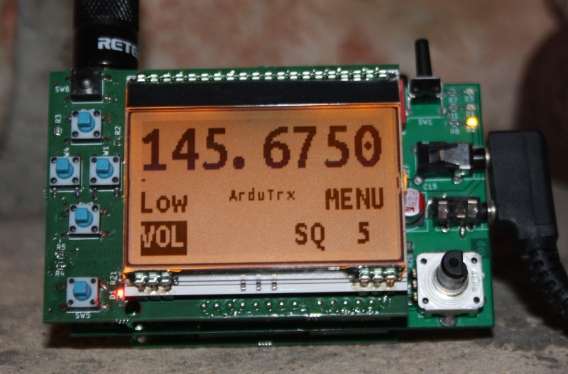

ArduTrx on Arduino MKR

Ham Radio Transceiver for Arduino with Dorji DRA818 module
Software for the ArduTrx shield on a Arduino MKR WIFI 1010 board

project info: http://ardutrx.generationmake.de/

description: https://www.element14.com/community/community/project14/rf/blog/2020/01/15/ardutrx-with-arduino-mkr

